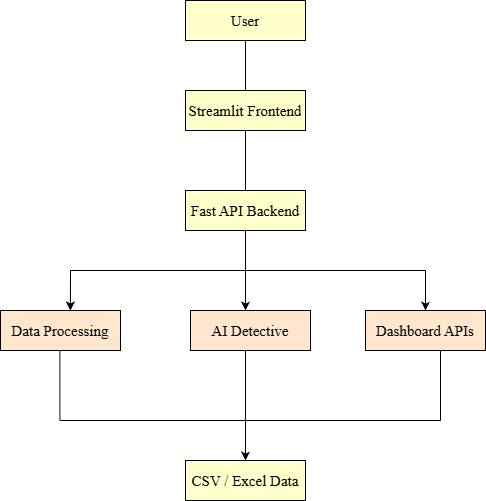
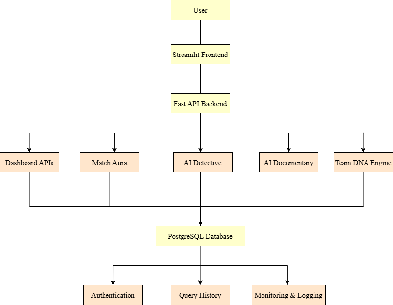

# Production Architecture

## Objective

This document outlines how the current IPL Dashboard architecture can evolve into a production-ready system capable of supporting thousands of concurrent users while remaining scalable, maintainable, and extensible.

---

# Current Architecture

The current prototype follows a simple three-layer architecture.

```
                Streamlit Frontend
                        │
                        ▼
                 FastAPI Backend
                        │
                        ▼
                CSV / Excel Files
```



### Characteristics

- Streamlit-based user interface
- FastAPI handles API requests
- CSV and Excel files act as the primary data source
- AI features are executed directly within the backend
- Designed for local development and experimentation

---

# Production Architecture

A production deployment separates responsibilities into multiple independent services.

```
                                   Users
                                     │
                                     ▼
                         Authentication Service
                                     │
                                     ▼
                            Streamlit Frontend
                                     │
                                     ▼
                              FastAPI Backend
      ┌──────────────────────┼──────────────────────┐
      │                      │                      │
      ▼                      ▼                      ▼
Analytics Engine        AI Engine           Query Processor
      │                      │                      │
      └──────────────┬───────┴──────────────┬───────┘
                     ▼                      ▼
             PostgreSQL Database      Background Workers
                     │
                     ▼
              Monitoring & Logging
```



---

# Component Responsibilities

| Component | Responsibility |
|------------|----------------|
| Streamlit Frontend | User interface and dashboard interaction |
| Authentication Service | User login, registration, session management |
| FastAPI Backend | API routing and request processing |
| Analytics Engine | Statistical analysis and cricket insights |
| AI Engine | AI Detective, Match Aura, Documentary Generator, Team DNA |
| Query Processor | Process user requests and prepare data |
| PostgreSQL | Persistent storage |
| Background Workers | Execute long-running AI tasks |
| Monitoring & Logging | System health monitoring and debugging |

---

# Data Flow

## Step 1

User selects a match or enters a natural language query.

↓

## Step 2

The Streamlit frontend sends the request to the FastAPI backend.

↓

## Step 3

FastAPI validates the request using Pydantic models.

↓

## Step 4

The Query Processor retrieves the required match information.

↓

## Step 5

The Analytics Engine computes statistics and cricket insights.

↓

## Step 6

The AI Engine generates narrative explanations and reports.

↓

## Step 7

The processed data is returned to the frontend.

↓

## Step 8

The dashboard displays tables, visualizations, and AI-generated insights.

---

# Scalability Improvements

| Current Prototype | Production Improvement |
|-------------------|------------------------|
| CSV files | PostgreSQL database |
| Local execution | Cloud deployment |
| Single backend | Load-balanced FastAPI services |
| No authentication | JWT authentication |
| Local AI execution | Dedicated AI service |
| No caching | Redis caching |
| No monitoring | Logging and monitoring tools |

---

# Benefits of the Production Architecture

- Supports multiple concurrent users.
- Enables secure authentication and authorization.
- Improves performance through caching and background processing.
- Provides persistent storage for users and AI reports.
- Simplifies future feature development.
- Supports deployment to cloud infrastructure.

---

# Future Expansion

The production architecture has been designed to support upcoming enhancements, including:

- Match Aura
- AI Documentary Generator
- Team DNA Engine
- Voice Search
- Natural Language Queries
- Saved AI Reports
- User Profiles
- Cloud Deployment